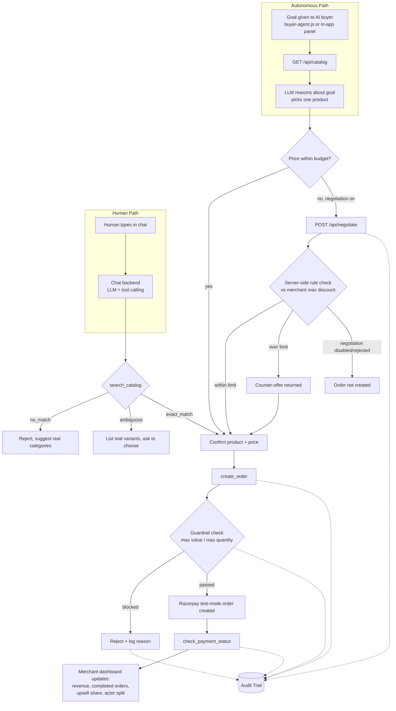

# Cartwise — Conversational Checkout & Agentic Commerce

**Razorpay AI Buildathon — Track 01: AI Growth & Agentic Commerce**

Cartwise is a catalog-grounded shopping assistant that serves **two kinds of buyers**: a human having a natural conversation, and an autonomous AI agent acting entirely on its own. Both go through the same server-enforced guardrails, the same order-creation logic, and the same explainable audit trail — proving the store is safely "sellable to AI buyers," not just usable by humans.

---

## Screenshots

**Storefront (human chat) + Autonomous AI buyer agent, side by side**


**Merchant dashboard — revenue, guardrails, campaign orchestrator**


**Explainable audit trail — every action tagged by type and actor (human vs AI buyer)**


---

## What this actually does

- A customer can browse and buy through natural conversation — the agent only ever answers from the real catalog, never invents a product
- A separate, independent AI agent can be given a single goal ("buy the best running shoes for a long run, budget ₹2500") and will inspect the catalog, reason about the best match, negotiate on price within merchant-set limits, and complete a real order — with zero further human input
- A merchant dashboard shows real revenue, upsell attribution, guardrail enforcement, and a self-refreshing growth recommendation, all computed from actual order data
- Every money-related action — accepted or rejected — is logged with a plain-language reason, tagged by category (business vs technical) and by actor (human vs AI buyer)

---

## Features

| Area | What's implemented |
|---|---|
| **Conversational checkout** | Catalog search with three distinct states (no match / ambiguous / exact match), natural confirmation flow, real Razorpay test-mode payment |
| **Upsell** | Catalog-defined complementary product pairings, surfaced at checkout, tracked separately in revenue reporting |
| **Autonomous AI buyer** | Standalone Node script (`buyer-agent.js`) and an in-app panel — both call the same public API a real third-party agent would use |
| **Agent-readable API** | `GET /api/catalog`, `POST /api/order`, `GET /api/order/{id}/status` — a clean, structured interface independent of the chat UI |
| **Negotiation** | Buyer agent can request a discount; the server evaluates it against a merchant-configured max auto-approved discount and accepts, counters, or rejects — deterministic and auditable, not LLM-approved |
| **Guardrails** | Max order value, max quantity per item, and negotiation limits — enforced server-side for both chat and API orders, merchant-configurable from the dashboard |
| **Merchant dashboard** | Revenue (with upsell attribution), completed-order breakdown with failure reasons, guardrail-block counter, human-vs-AI-buyer split, campaign orchestrator |
| **Campaign orchestrator** | Analyzes current completed orders and stock on demand, generates one grounded, data-specific growth suggestion |
| **Explainable audit trail** | Every action logged with plain-language reasoning; filterable by type (Orders/Rejections/Upsells) and by actor (Human/AI buyer); technical lifecycle events hidden by default, toggleable for debugging |
| **Auth** | Email/password login via Firebase, gating the human-facing UI (the agent-facing API remains open, since a calling agent has no browser session) |

---

## Architecture

### System diagram



### Step-by-step: human buyer flow
1. Human sends a message in the chat UI
2. Backend calls `search_catalog`, which returns one of three states: `no_match`, `ambiguous`, or `exact_match` — the LLM's response is dictated by this state, not free-formed, so it can't invent a product or silently guess between variants
3. Once a single product is confirmed, `create_order` runs the same server-side guardrail checks used by the autonomous path (max order value, max quantity)
4. If passed, a real Razorpay test-mode order is created; the browser only ever receives the public Key ID, never a secret
5. After the human completes payment in the Razorpay Checkout widget, `check_payment_status` verifies the result server-side and persists the final status
6. Every step above is written to the audit trail, tagged `category: business` and `actor: human_chat`

### Step-by-step: autonomous AI buyer flow
1. A goal is given to the buyer agent (`buyer-agent.js` from the terminal, or the in-app "AI buyer agent" panel) — no further human input follows
2. It calls `GET /api/catalog` directly — the same structured data the chat's `search_catalog` reads from, just exposed as a plain endpoint
3. An LLM (Gemini) reasons over the goal and the catalog and returns a structured decision: `{product_id, quantity, size, reasoning}`. If the required API key isn't set, the script exits with an explicit error rather than silently falling back to a hardcoded rule
4. If the goal implies a budget below the listed price and negotiation is enabled, it calls `POST /api/negotiate` — the server evaluates the requested discount deterministically against the merchant's configured max auto-approved discount (this decision is rule-based, not LLM-approved, so it stays predictable and auditable) and returns accept / counter-offer / reject
5. Once a price is agreed, it calls `POST /api/order` — routed through the **exact same** `create_order` function and guardrail checks as the human chat path
6. `GET /api/order/{id}/status` confirms the final payment state
7. Every step is written to the same audit trail, tagged `actor: autonomous_agent`, so it's distinguishable from human orders at a glance

### Why both paths share one core
The human chat path and the autonomous agent path are two different *entry points* into the same underlying order pipeline — they are not two separate implementations. This is deliberate: it's what makes "the same guardrails and audit trail apply no matter who's buying" a verifiable architectural fact, not just a claim in a pitch.

---

## Run locally

```powershell
python -m venv .venv
.\.venv\Scripts\Activate.ps1
pip install -r requirements.txt
Copy-Item .env.example .env
# Add your Razorpay Test API Key and Test Key Secret to .env
uvicorn app.main:app --reload
```

Open <http://127.0.0.1:8000>.

Merchant analytics, guardrails, campaign recommendations, and the explainable audit trail are at <http://127.0.0.1:8000/merchant>.

Cartwise uses one shared dashboard design system across the authenticated storefront and merchant tools: persistent navy navigation, shared cards and indigo actions, and responsive mobile drawers. The revenue hero retains a warm analytics accent. Login and signup reuse the same tokens without authenticated navigation.

---

## Autonomous buyer

With the server running, launch a UI-independent buyer (Node 20+):

```bash
node --env-file=.env buyer-agent.js "Buy the cheapest in-stock running shoes, size 9"
```

It reads `GET /api/catalog`, requires a structured Gemini decision, and creates the server-priced order through `POST /api/order`. Check it with `GET /api/order/{id}/status`. The script exits immediately when `GEMINI_API_KEY` is unavailable — it never silently substitutes deterministic purchasing logic, so every purchase decision you see is a genuine model output.

If the goal implies a budget below the listed price and negotiation is enabled in merchant settings, the agent will request a discount through `POST /api/negotiate` before finalizing the order, and the merchant's configured auto-approval threshold determines the outcome.

Without Razorpay credentials, the app uses a safe demo checkout, including a reproducible failed-payment button. With `RAZORPAY_KEY_ID` and `RAZORPAY_KEY_SECRET`, it creates Razorpay test-mode orders, opens the official Checkout widget, and verifies its payment signature on the server.

---

## Demo sequence

1. `hi`
2. `show me running shoes under 3000`
3. Choose an item card or say `StrideRun Aero Blue`.
4. Say `give me the payment link` to display checkout.
5. Use **Simulate failure** for the deliberate failure case, or complete the test payment.
6. Say `buy 500 pairs of shoes` to demonstrate the visible quantity guardrail.
7. Say `show me kurtis` to see a catalog-aware off-catalog response.
8. Switch to the **AI buyer agent** panel, give it a goal like `Buy the best running shoes for a long, comfortable run`, and watch it reason, decide, and check out with zero further input.
9. Give it a goal with a tight budget (e.g., `Buy running shoes, budget ₹2500`) to see it attempt negotiation.
10. Open the **Merchant Dashboard** to see revenue, guardrail blocks, and the human-vs-AI-buyer split update in real time, then click **Run campaign check** for a live, data-grounded growth suggestion.

---

## Safety and auditability

- Catalog, stock, size, quantity, and order-value rules are enforced on the server and configured from the merchant dashboard — not just suggested in a prompt.
- Products are selected and confirmed before checkout; the browser only ever receives the public Razorpay Key ID.
- Duplicate matching orders in the same session are blocked for five minutes.
- Negotiation decisions are rule-based and deterministic on the merchant side, not LLM-approved — discount limits are predictable and auditable.
- `GET /api/catalog` is an AI-readable merchant catalog, independent of the chat interface.
- `GET /api/audit` and the in-app audit trail record actual search, selection, order, payment, negotiation, and guardrail inputs and outcomes — categorized as business or technical, and tagged by actor (human or autonomous agent).

---

## Why this fits Track 01

The track asks for growth *and* for merchants to be "sellable to AI buyers." Most conversational-commerce submissions stop at the human chat experience. Cartwise treats the autonomous agent path as a first-class citizen: the same catalog, the same order pipeline, the same guardrails, and the same audit trail serve both a human and an independent AI buyer — with the merchant dashboard making that dual reality visible and controllable in one place.

## About

Cartwise is a conversational shopping and checkout web app. Users can ask about products, prices, sizes, stock, comparisons, and budgets; the app answers only from its catalog and lets them select an item, confirm an order, and complete a demo or Razorpay test checkout. It also enforces stock, quantity, and order-value limits — for both human and autonomous AI buyers — with a full explainable audit trail.
